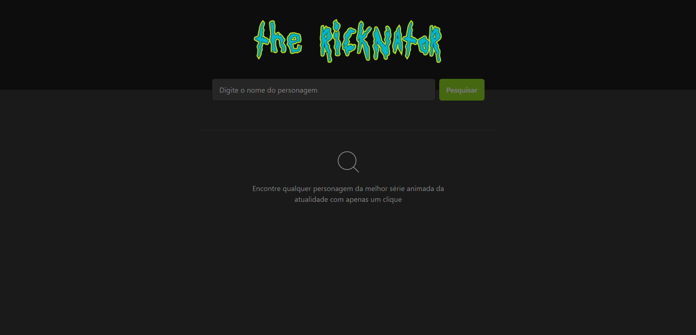

<h1 align="center"> the-ricknator </h1>

  <a href="#-tecnologias">Tecnologias</a>&nbsp;&nbsp;&nbsp;|&nbsp;&nbsp;&nbsp;
  <a href="#-projeto">Projeto</a>&nbsp;&nbsp;&nbsp;|&nbsp;&nbsp;&nbsp;
  <a href="#memo-licença">Licença</a>

  

 

  

## 🚀 Tecnologias

Esse projeto foi desenvolvido com as seguintes tecnologias:

- React
- TypeScript
- TailwindCSS
- React Toastfy

## 🔥 Algumas features neste projeto

- React Hooks
- Integração com API externa
- Estilização com TailwindCSS

## ✨ Neste projeto você pode ver

- Um campo de texto para pesquisar personages do seriado animao Rick and Morty
- Após pesquisar por um nome, listagem de todas as variações do personagem
- Quantidade de personagens encontrados através do nome pesquisado
- Filtragem da lista por ordem alfabética ou pelo id de cada item da lista

## 💻 Projeto

- Esta é uma aplicação básica que consome a API externa do seriado animado Rick and Morty e lista os personagens de acordo com o nome pesquisado

## 📝 Licença

Esse projeto está sob a licença MIT.

---
